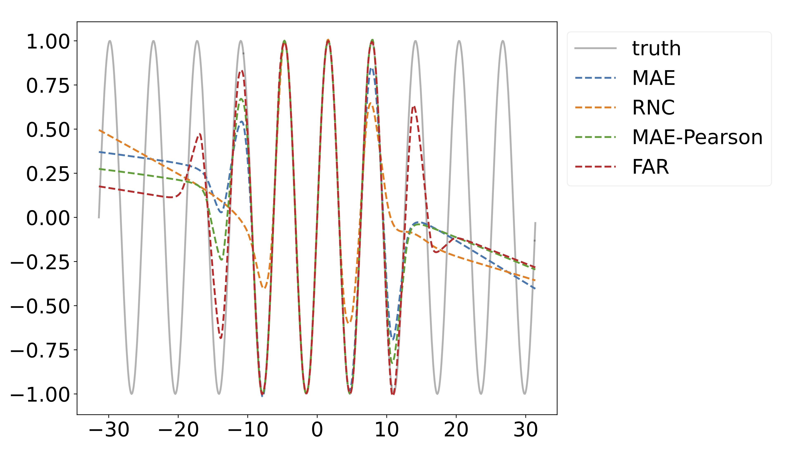
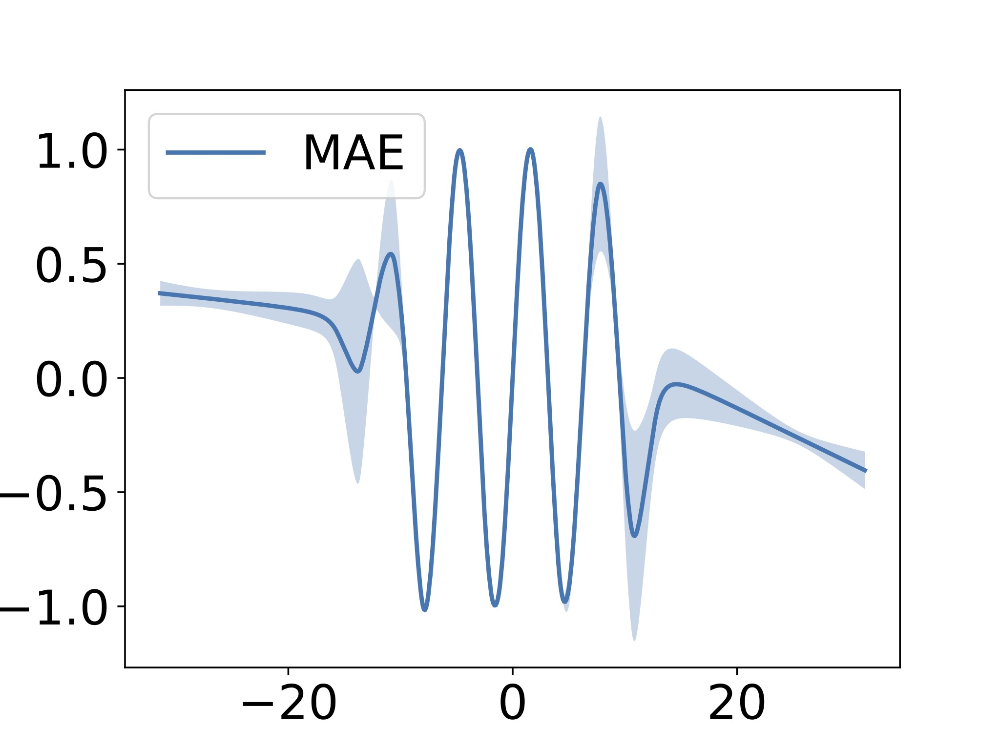
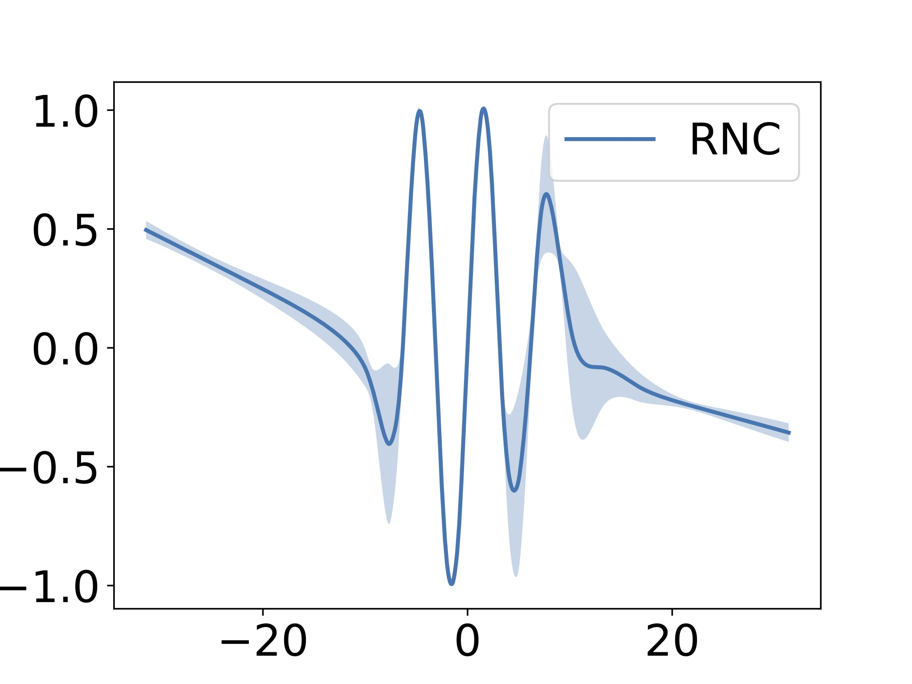
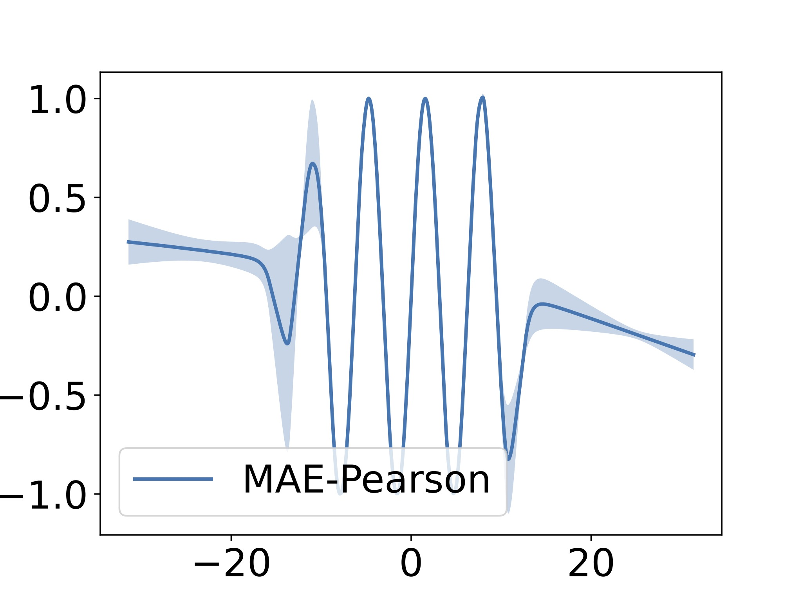
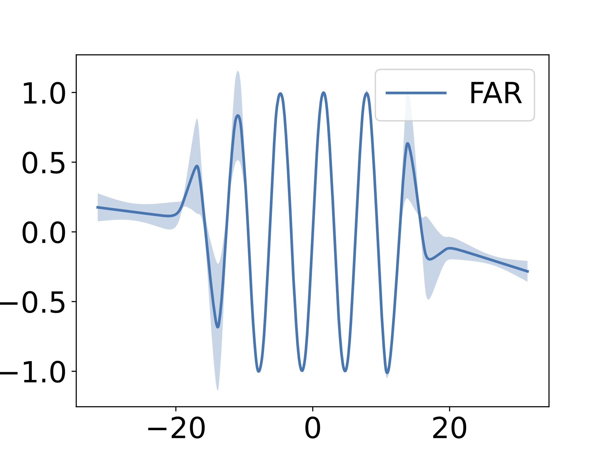
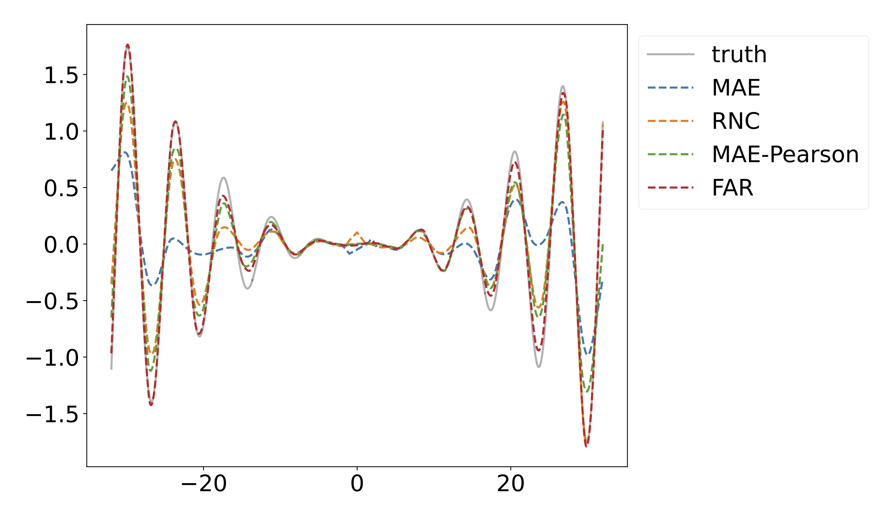
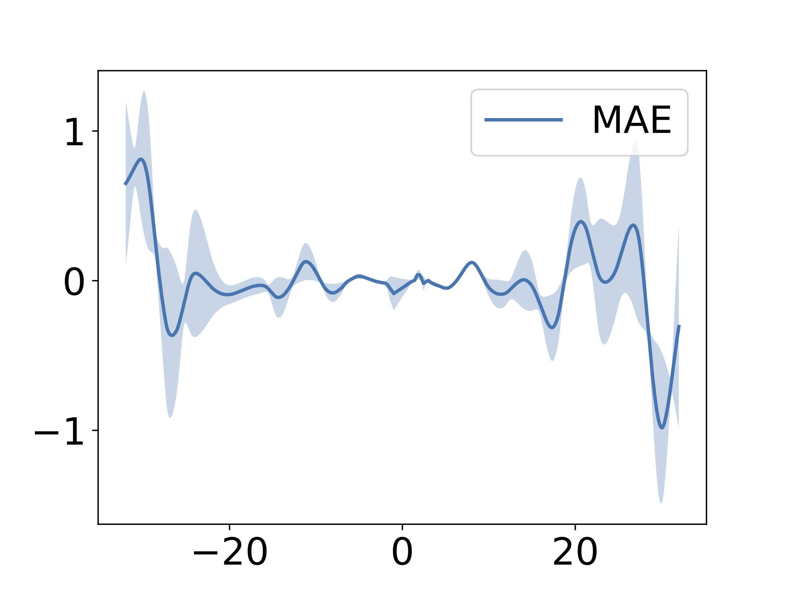
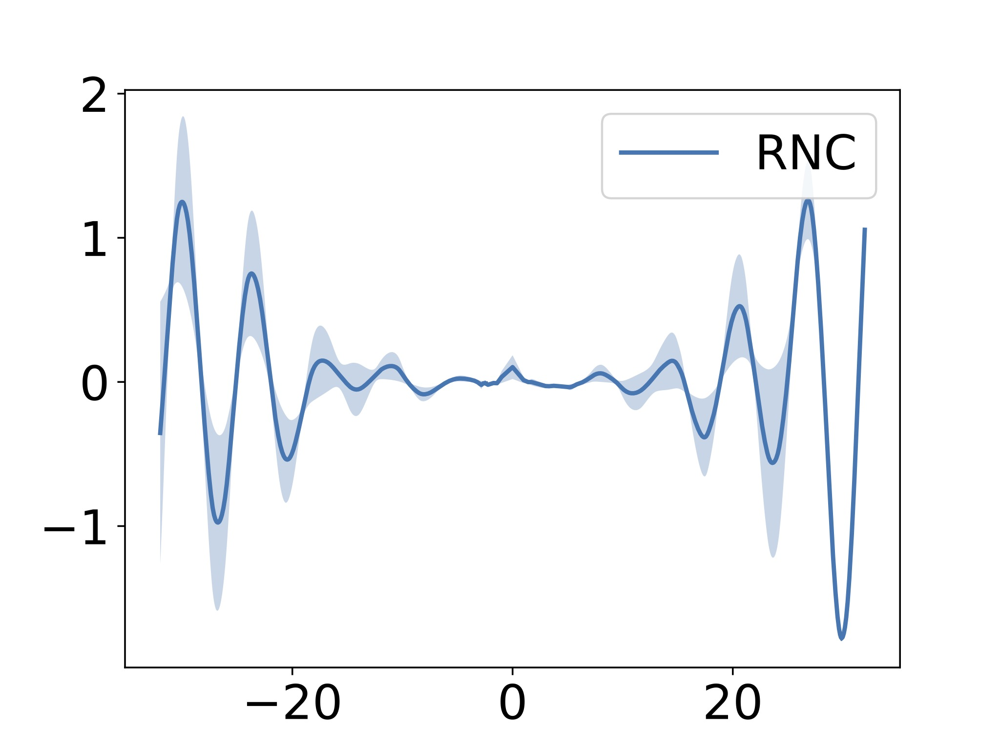
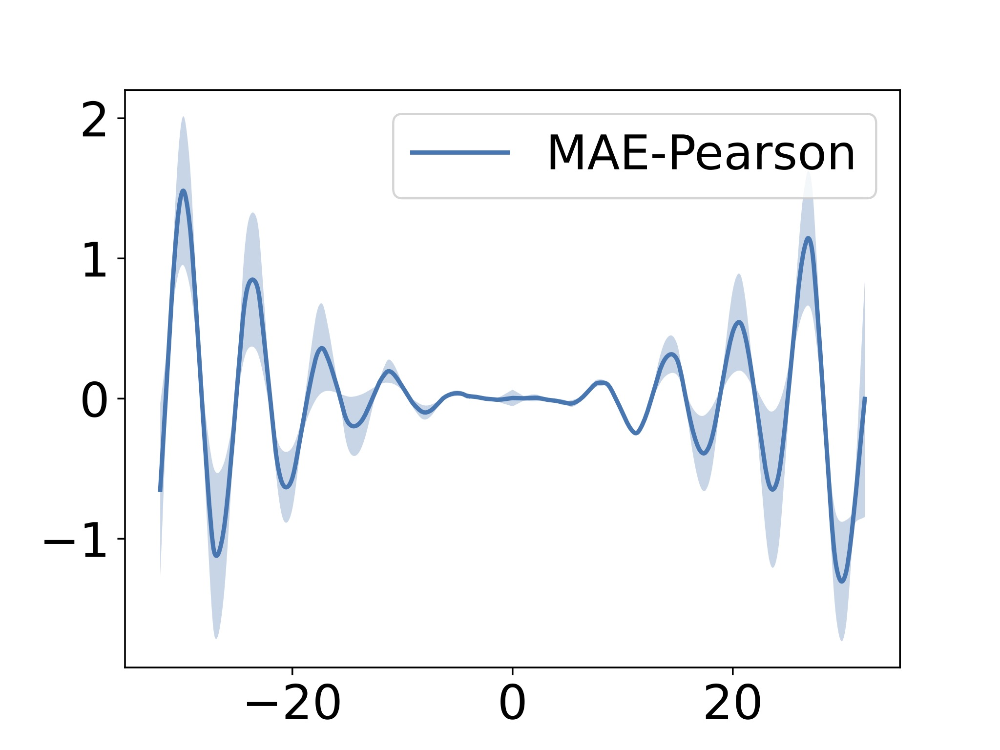
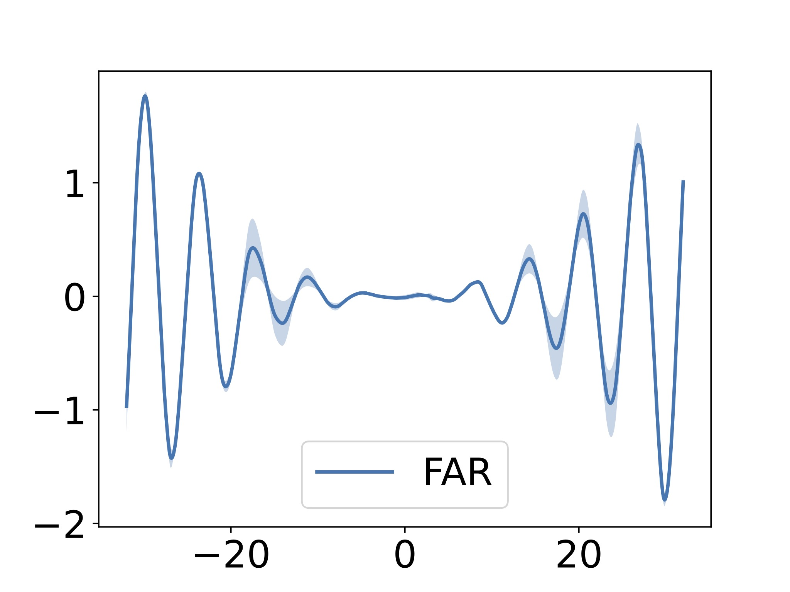

# FAR 
Function Aligned Regression <a href="https://arxiv.org/pdf/2402.06104.pdf">[arxiv paper]</a>.

FAR motivated by the idea that Regression loss function should not only learns the function value but also function derivatives. The conventional regression loss only focuses on function values.

Prerequisite: torch==2.0.0 

## Common usage examples:
### Easy to apply on your own code:

```python
from loss import FAR

# define loss function with alpha hyper-parameter.
criterion = FAR(alpha=0.2)

# ground truths: [bs, label_dim]
truths = ...
# predictions: [bs, label_dim]
preds = ...

# compute FAR loss
loss = criterion(preds, truths)
```
### On tabular datasets:
- <code> python3 main.py --loss=FAR --dataset=wine_quality --lr=1e-2 --decay=1e-4 </code>
- <code> python3 main.py --loss=MAE --dataset=wine_quality --lr=1e-2 --decay=1e-4 </code>

### On Image dataset (AgeDB Scratch or Linear Probe Based on RNC):
Make sure you have AgeDB data and pass it to the code by '--data_folder'.
- From scratch:  <code> python3 ageDB_scratch.py --alpha=0.1 --learning_rate=0.5 --weight_decay=1e-4 --loss=FAR --data_folder='your-AgeDB-folder' </code>
- Linear probe:  <code> python3 ageDB_linear.py --alpha=0.1 --learning_rate=0.05 --weight_decay=1e-4 --loss=FAR --data_folder='your-AgeDB-folder' --ckpt='path-to-pretrained-model' </code>

We thank the <a href="https://github.com/kaiwenzha/Rank-N-Contrast">previous work</a> that provides general experimental settings for AgeDB.

## Synthetic Experiments:
Please check synthetic.ipynb for how to run on the two synthetic (Sine and Squared Sine) datasets. 

Alternatively, there are google colab files for <a href="https://colab.research.google.com/drive/1czRNpSGAkQtFksK0JmToQLa0_csmfBmC?usp=drive_link">sine dataset</a> and <a href="https://colab.research.google.com/drive/1XeGWBWLs05mHzD67GItn47l-lB_7V-bb?usp=drive_link">squared sine dataset</a>. Please make sure upload FAR related code (loss.py, models.py, utils.py) and synthetic data (sine.npz, sq_sine.npz) to colab folder.

<p align="center">
  
</p>
<p align="center">
  
  
</p>

<p align="center">
  
  
</p>

<p align="center">
  
</p>
<p align="center">
  
  
</p>

<p align="center">
  
  
</p>


:page_with_curl: Citation
---------
If you find FAR useful in your work, please cite the following paper:
```
@misc{zhu2024function,
      title={Function Aligned Regression: A Method Explicitly Learns Functional Derivatives from Data}, 
      author={Dixian Zhu and Livnat Jerby},
      year={2024},
      eprint={2402.06104},
      archivePrefix={arXiv},
      primaryClass={cs.LG}
}
```
